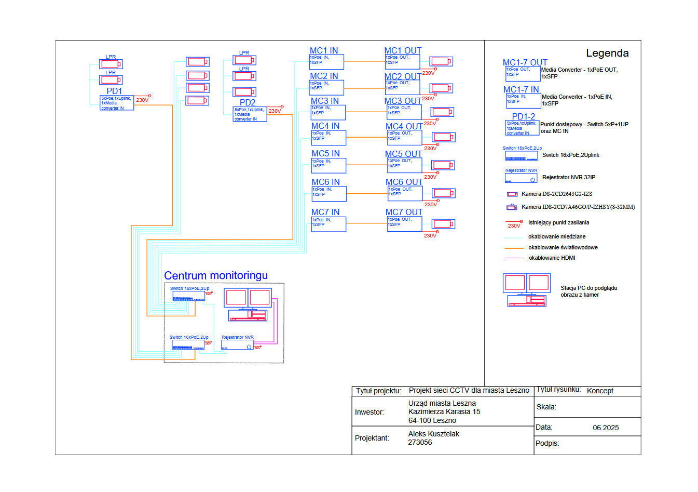
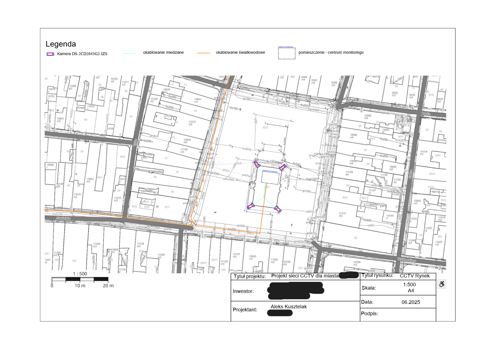
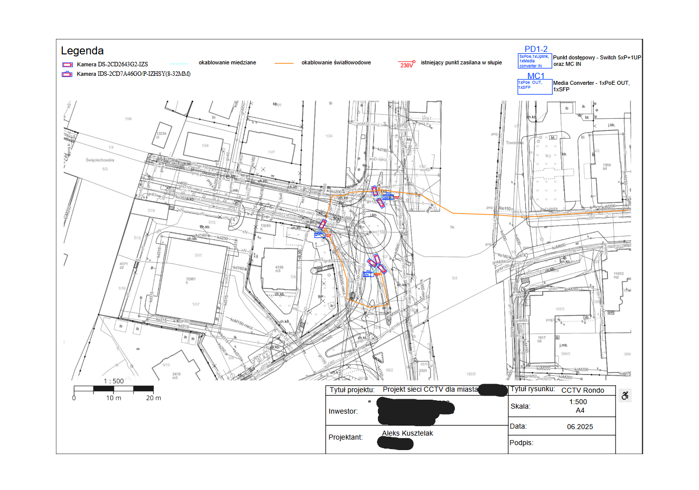
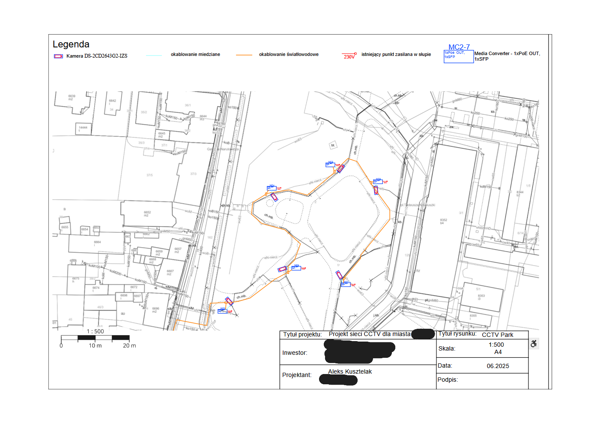

# IP CCTV Network Design

Design of a city-scale IP CCTV monitoring network developed as part of
the Telecommunications Network Design course.

The project covers the design of a surveillance network connecting
multiple monitoring locations to a central monitoring station using
IP cameras, PoE Ethernet and fiber-optic infrastructure.

## Project Scope

The CCTV system was designed for three types of monitored areas:

- city center,
- public park,
- road intersection / roundabout.

The system uses a central NVR for recording and monitoring video streams
from distributed IP cameras.

## Network Architecture

The designed infrastructure includes:

- IP CCTV cameras,
- LPR / ANPR cameras,
- PoE switches,
- Ethernet connections,
- fiber-optic backbone,
- SFP transceivers,
- Ethernet-to-fiber media converters,
- 32-channel NVR,
- monitoring workstation.



## Technologies

- IP CCTV
- Ethernet
- Fiber Optics
- PoE / IEEE 802.3af/at
- SFP
- NVR
- H.264 / H.265
- LPR / ANPR
- IP networking

## Selected Hardware

### NVR

A 32-channel network video recorder was selected as the central
recording system.

The system supports:

- up to 32 IP camera channels,
- H.264 / H.265 video compression,
- multiple HDDs,
- high-resolution IP cameras,
- ANPR/LPR cameras.

### Cameras

Two types of IP cameras were included in the design:

**Standard surveillance cameras**
- 4 MP resolution
- PoE
- infrared illumination
- outdoor enclosure
- vandal resistance

**LPR / ANPR cameras**
- automatic license plate recognition
- 4 MP resolution
- PoE
- infrared illumination
- outdoor installation

### Network Infrastructure

PoE switches provide both network connectivity and power to the
cameras.

Fiber-optic links are used for longer-distance connections between
monitoring locations and the central monitoring station.

SFP modules and Ethernet/fiber media converters provide connectivity
between the copper Ethernet and fiber-optic sections.

## Network Topology

```text
IP Cameras
    │
    │ Ethernet + PoE
    ▼
PoE Switch
    │
    │ Ethernet
    ▼
Media Converter
    │
    │ Fiber Optic
    ▼
Media Converter
    │
    ▼
Central PoE Switch
    │
    ├──── NVR
    │
    └──── Monitoring Workstation

## Deployment Plans

### City Center



### Roundabout



### Public Park


